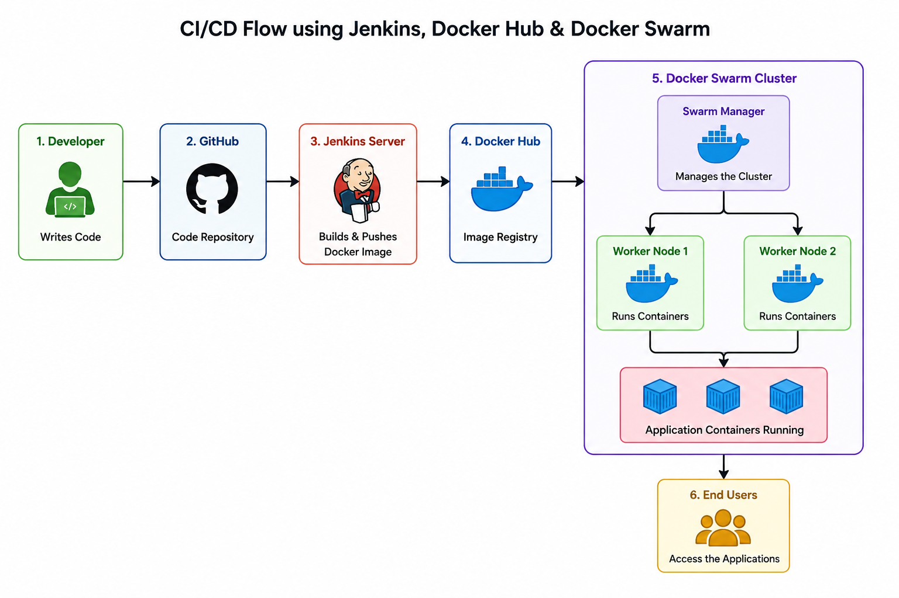
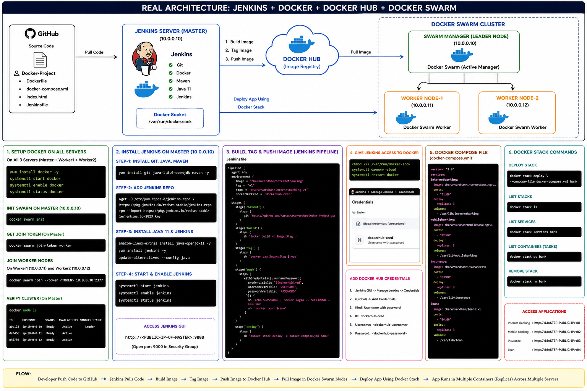
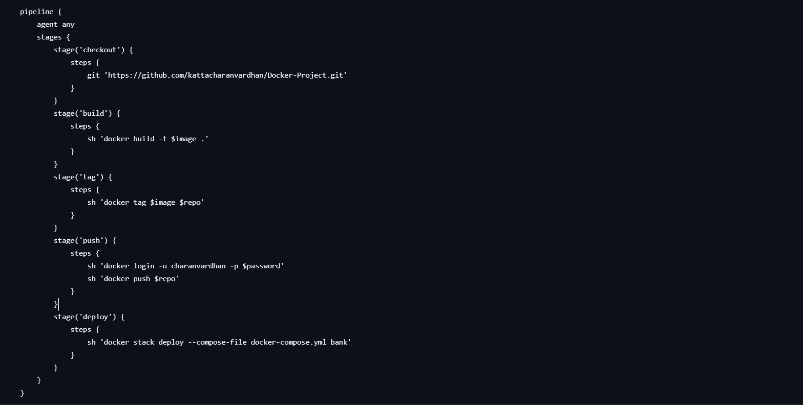
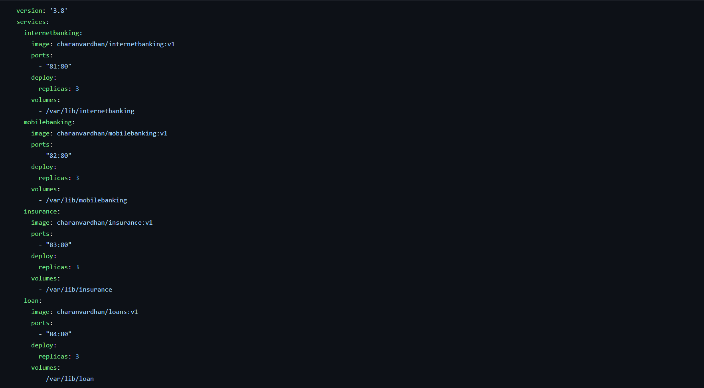

# 🚀 Docker Swarm CI/CD Pipeline using Jenkins & Docker Hub

## 📌 Project Overview

This project demonstrates the implementation of a complete Continuous Integration and Continuous Deployment (CI/CD) pipeline using Jenkins, Docker, Docker Hub, and Docker Swarm. The primary objective is to automate the software delivery process, from source code integration to application deployment across multiple servers.

The pipeline begins when developers push application source code to a GitHub repository. Jenkins continuously monitors the repository and automatically triggers a pipeline whenever new changes are detected. The pipeline checks out the latest source code, builds a Docker image using a Dockerfile, tags the image with a version, and pushes it to Docker Hub.

Once the image is successfully published, Jenkins deploys the latest version of the application to a Docker Swarm cluster using Docker Stack. The Swarm Manager schedules containers across multiple worker nodes, ensuring high availability, load distribution, and easy scalability. This automation minimizes manual intervention, reduces deployment errors, and enables faster software delivery.

Developers push source code to GitHub, Jenkins automatically detects the changes, builds Docker images, pushes them to Docker Hub, and deploys the latest version to a Docker Swarm cluster using Docker Stack.

---

# 🏗️ Architecture

<p align="center">
  
</p>

---

# 🔄 Project Workflow

1. Developer pushes source code to GitHub.
2. Jenkins pulls the latest source code from GitHub.
3. Jenkins builds Docker images using the Dockerfile.
4. Docker images are tagged automatically.
5. Jenkins authenticates with Docker Hub.
6. Docker images are pushed to Docker Hub.
7. Jenkins deploys the application using Docker Stack.
8. Docker Swarm Manager schedules containers.
9. Worker nodes pull the latest images from Docker Hub.
10. Applications run as multiple replicas for High Availability.

---

# 🛠️ Technologies Used

- Linux (Amazon Linux)
- Git & GitHub
- Jenkins
- Docker
- Docker Hub
- Docker Compose
- Docker Swarm
- Docker Stack
- Apache2
- Shell Scripting

---

# ✨ Key Features

- Automated CI/CD Pipeline
- Automatic GitHub Integration
- Docker Image Creation
- Automatic Image Tagging
- Docker Hub Integration
- Docker Swarm Cluster
- Multi-Node Deployment
- Docker Stack Deployment
- High Availability
- Container Replication
- Automated Application Updates
- Infrastructure Automation

---

# 📁 Project Structure

```
Docker-Project/
│
├── Dockerfile
├── docker-compose.yml
├── Jenkinsfile
├── index.html
├── README.md
└── images/
    ├── architecture.png
    ├── jenkins-pipeline.png
    ├── docker-swarm.png
    └── output.png
```

---

# 📚 What I Learned

- Building custom Docker images using Dockerfiles.
- Managing multiple containers with Docker Compose.
- Creating and managing Docker Swarm clusters.
- Deploying applications using Docker Stack.
- Writing Jenkins Pipelines (Declarative Pipeline).
- Integrating Jenkins with GitHub for automated builds.
- Integrating Jenkins with Docker using the Docker socket.
- Authenticating Jenkins with Docker Hub using Credentials.
- Building, tagging, and pushing Docker images automatically.
- Deploying applications across multiple Swarm worker nodes.
- Implementing High Availability using service replicas.
- Managing Docker services, stacks, and nodes.
- Understanding container orchestration concepts.
- Troubleshooting Docker, Jenkins, and Swarm deployments.

---

# 🎯 Project Outcomes

- Successfully automated the complete application deployment process.
- Reduced manual deployment effort using Jenkins pipelines.
- Implemented Continuous Integration and Continuous Deployment (CI/CD).
- Built reusable Docker images for multiple applications.
- Deployed applications across multiple servers using Docker Swarm.
- Achieved High Availability with multiple service replicas.
- Centralized image management using Docker Hub.
- Improved deployment speed and consistency.
- Gained hands-on experience with real-world DevOps workflows.

---

# 📸 Project Screenshots

## Architecture



---

## Jenkins Pipeline



---

## Docker Swarm Cluster



---

## Application Output


---

# 🚀 Deployment Commands

```bash
docker swarm init

docker stack deploy -c docker-compose.yml bank

docker stack ls

docker stack services bank

docker stack ps bank

docker service ls

docker node ls
```

---

# 👨‍💻 Author

**Charan Vardhan Katta**

DevOps Engineer | AWS | Docker | Kubernetes | Jenkins | Terraform | Ansible | Linux | CI/CD
